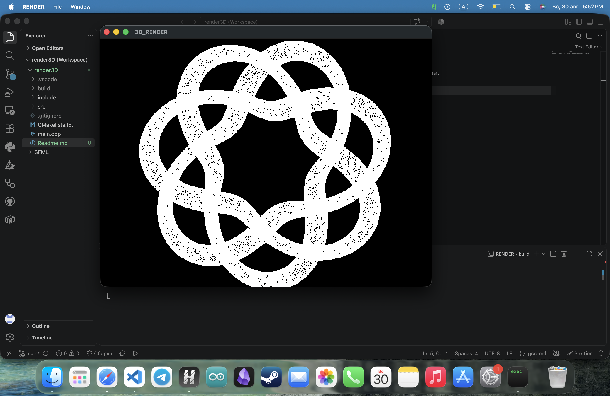

# Render3D 

**Render3D** — это легковесная утилита на C++ для отрисовки 3D-объектов формата `.obj` в двухмерном пространстве.



## 🛠 Стек технологий 
* **Язык:** C++ 17
* **Графическая библиотека:** SFML

## Установка и запуск

### Требования
Для сборки проекта вам понадобятся `CMake` и установленная библиотека [SFML](https://www.sfml-dev.org/download/).

### Пошаговая сборка

1. Создайте новую папку, откройте в ней терминал и клонируйте репозиторий:
   ```bash
   git clone https://github.com/Aldrynkin1/render3D
   cd render3D
   ```

2. Создайте директорию для сборки и перейдите в неё:
   ```bash
   mkdir build
   cd build
   ```

3. Сгенерируйте файлы сборки через CMake и скомпилируйте проект:
   ```bash
   cmake ..
   cmake --build .
   ```

## Разработчик
* **Дрынкин Альберт** — [@diamondsonmykok]
